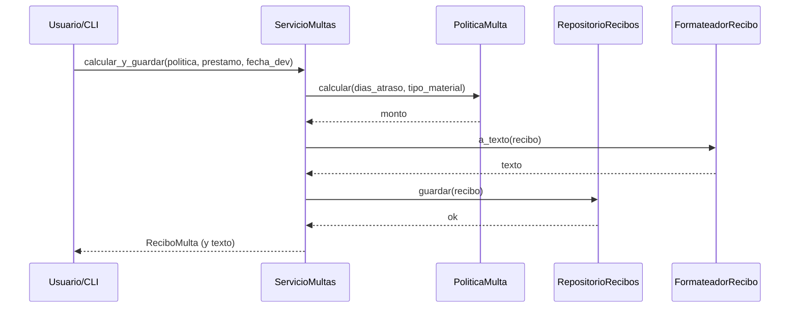

# Sistema de Multas y Préstamos de Biblioteca (Tarea II)

Curso: Programación II  
Profesor: Ing. Lenin A. Ortega Jiménez  
Estudiantes: Nicole Sánchez Gómez, Reymond Rojas Núñez  
Fecha: Noviembre 2025

---

## 1) Introducción

Esta aplicación en **Python** gestiona préstamos de materiales de biblioteca, calcula **multas** con **políticas intercambiables** y emite/guarda un **recibo de multa**. Se aplican los principios **SOLID** y la **Ley de Deméter**, usando **POO**, `dataclasses`, **Protocol/ABC** y una **interfaz mínima CLI**.

---

## 2) Estructura del proyecto

```
Tarea 2 Biblioteca/
│
├── domain/
│   ├── modelos.py              # Usuario, Material, Prestamo, ReciboMulta (dataclasses)
│   └── politicas.py            # PoliticaMulta (ABC/Protocol) y políticas:
│                               #   FijaPorDia, Escalonada, ConTope (decorador),
│                               #   ConDescuento (decorador)
│
├── services/
│   └── multas.py               # ServicioMultas: orquesta casos de uso
│
├── ports/
│   ├── repositorios.py         # Protocol RepositorioRecibos (guardar, listar)
│   └── formateo.py             # Protocol FormateadorRecibo (a_texto)
│
├── adapters/
│   ├── repo_archivo.py         # Adaptador: persistencia en archivo o shelve
│   └── formateador_texto.py    # Adaptador: formatea el recibo en texto
│
├── ui/
│   └── cli.py                  # Interfaz de línea de comandos (CLI)
│
└── utils/
    └── validacion.py           # Validaciones / parsing seguro de entradas
```

> Nota: La estructura respeta **DIP** (servicio depende de puertos) y facilita **OCP** para agregar nuevas políticas sin tocar el servicio/UI.

---

## 3) Instrucciones de ejecución

### Requisitos
- Python 3.10+ (recomendado)
- No se requieren frameworks web ni ORMs.

### Ejecución
```bash
# Ubicarse en la carpeta del proyecto
python -m ui.cli
```

Flujo del menú (ejemplo):
```
=== Sistema de Multas de Biblioteca ===
1. Registrar préstamo
2. Devolver material y calcular multa
3. Listar recibos guardados
4. Salir
```

---

## 4) Diagramas (Mermaid)

### 4.1 Arquitectura (capas / puertos y adaptadores)

```mermaid
flowchart LR
  subgraph UI
    CLI[cli.py]
  end

  subgraph Services
    SM[ServicioMultas]
  end

  subgraph Domain
    M[modelos.py
Usuario|Material|Prestamo|ReciboMulta]
    P[politicas.py
PoliticaMulta +
FijaPorDia|Escalonada|ConTope|ConDescuento]
  end

  subgraph Ports
    R[(RepositorioRecibos
Protocol)]
    F[(FormateadorRecibo
Protocol)]
  end

  subgraph Adapters
    RA[repo_archivo.py]
    FT[formateador_texto.py]
  end

  CLI --> SM
  SM --> M
  SM --> P
  SM --> R
  SM --> F
  R --> RA
  F --> FT
```

### 4.2 Secuencia “calcular y guardar”



---

## 5) Mapa de Principios SOLID + Deméter

| Principio | Aplicación concreta |
|---|---|
| **S** (Responsabilidad Única) | `Usuario/Material/Prestamo/ReciboMulta` solo datos; `ServicioMultas` solo orquestación; `FijaPorDia/Escalonada/ConTope/ConDescuento` solo cálculo; `repo_archivo` solo persistencia; `formateador_texto` solo formateo. |
| **O** (Abierto/Cerrado) | Nuevas políticas se agregan como clases nuevas sin modificar `ServicioMultas` ni `CLI`. |
| **L** (Sustitución de Liskov) | Cualquier `PoliticaMulta` respeta `calcular(...) -> float` con misma semántica. |
| **I** (Segregación de Interfaces) | `RepositorioRecibos` solo `guardar/listar`; `FormateadorRecibo` solo `a_texto`. |
| **D** (Inversión de Dependencias) | `ServicioMultas` depende de **Protocols** (`RepositorioRecibos`, `FormateadorRecibo`, `PoliticaMulta`). |
| **Ley de Deméter** | `CLI` invoca métodos cortos del servicio (`registrar_prestamo`, `calcular_y_guardar`, `listar_recibos`, `texto_recibo`) sin encadenamientos. |

---

## 6) Ejemplo de uso

**Registrar préstamo**
```
Nombre usuario: Nicole
Categoría (estandar/estudiante/docente): estudiante
Título: Python Intermedio
Tipo (libro/revista/audiovisual): libro
Fecha de vencimiento (YYYY-MM-DD): 2025-10-20
```

**Devolver y calcular**
```
Fecha devolución (YYYY-MM-DD): 2025-10-27
Política: 1) Fija por día (tarifa=100)
=> Monto: ₡560.00 (con 20% de descuento por estudiante sobre ₡700)
```

---

## 7) Pruebas simples (sin pytest)

Cree un archivo `tests_simple.py` y ejecute:

```bash
python tests_simple.py
```

Contenido sugerido:

```python
from domain.politicas import FijaPorDia, Escalonada, ConDescuento, ConTope

def approx(a, b, eps=1e-6):
    return abs(a - b) <= eps

def test_fija_por_dia():
    p = FijaPorDia(100)
    assert approx(p.calcular(0, "libro"), 0)
    assert approx(p.calcular(5, "libro"), 500)

def test_escalonada_bordes():
    p = Escalonada(n=3, tarifa_a=50, tarifa_b=100)
    assert approx(p.calcular(3, "libro"), 150)   # 3*50
    assert approx(p.calcular(4, "libro"), 250)   # 3*50 + 1*100

def test_con_descuento():
    base = FijaPorDia(100)
    p = ConDescuento(base, 20)   # 20%
    assert approx(p.calcular(7, "libro"), 560)   # 700 * 0.8

def test_con_tope():
    base = FijaPorDia(100)
    p = ConTope(base, 500)
    assert approx(p.calcular(10, "libro"), 500)  # cap 500

if __name__ == "__main__":
    tests = [test_fija_por_dia, test_escalonada_bordes, test_con_descuento, test_con_tope]
    for t in tests:
        t()
    print("OK: 4 pruebas pasaron")
```

---

## 8) Demostración en video/GIF (2–3 min)

1. **Caso A**: Devolver con `FijaPorDia(tarifa=100)`  
2. **Caso B**: Devolver con `Escalonada(n=3, 50, 100)`  
3. **Decorador**: Aplicar `ConDescuento(..., 20%)` y mostrar cambio en el monto.  
4. **Evidencias**: Mostrar cómo `listar_recibos` recupera lo guardado.

Sugerencia para GIF con `ffmpeg` (Linux/macOS):

```bash
# Grabar pantalla (ajustar :0.0 y resolución según su equipo)
ffmpeg -video_size 1280x720 -f x11grab -i :0.0 -framerate 30 demo.mp4
# Convertir a GIF (opcional)
ffmpeg -i demo.mp4 -vf "fps=10,scale=960:-1:flags=lanczos" demo.gif
```

---

## 9) Anti-ejemplo y refactor

**Antes (mala práctica, OCP violado):**
```python
if tipo_usuario == "estudiante":
    multa = dias * 100 * 0.8
elif tipo_usuario == "docente":
    multa = dias * 100 * 0.9
else:
    multa = dias * 100
```

**Después (mejor diseño, OCP + Estrategia + Decorador):**
```python
politica = FijaPorDia(100)
if usuario.categoria == "estudiante":
    politica = ConDescuento(politica, 20)
elif usuario.categoria == "docente":
    politica = ConDescuento(politica, 10)
multa = politica.calcular(dias, tipo_material)
```

---

## 10) Decisiones de diseño y uso de IA (breve)

- **Estrategia** para políticas (`PoliticaMulta` + implementaciones).
- **Decoradores** (`ConDescuento`, `ConTope`) para componer reglas sin modificar las existentes (**OCP**).
- **DIP/ISP** con `Protocol` para repositorio y formateador: el servicio no conoce la implementación concreta.
- **Ley de Deméter**: la UI usa la **fachada** `ServicioMultas`.
- **IA**: Se usó para redactar borradores y el README. El **código de políticas/servicio/decoradores fue escrito/refactorizado por el equipo**, asegurando alineamiento con SOLID.

---

## 11) Auto-evaluación (plantilla)

- **SOLID/Deméter**: ✔️ aplicado consistentemente en capas, puertos y adaptadores.  
- **Políticas/Decoradores**: ✔️ `FijaPorDia`, `Escalonada`, `ConTope`, `ConDescuento` con pruebas de bordes.  
- **Servicio y CLI**: ✔️ flujo mínimo completo (`registrar → calcular/emitir → guardar → listar`).  
- **Persistencia/Formateo**: ✔️ desacoplados por Protocol.  
- **Documentación**: ✔️ README con diagramas Mermaid, mapa SOLID, instrucciones.  
- **Mejoras futuras**: manejo de i18n, nuevos tipos de material, exporte CSV/PDF del recibo.

---

## 12) Checklist de “hecho”

- [x] 3+ políticas + 1 decorador funcional.  
- [x] Servicio desacoplado (DIP) y UI cumpliendo Deméter.  
- [x] Repositorio y formateador vía Protocol (ISP + DIP).  
- [x] README con **dos diagramas Mermaid**, mapa SOLID e instrucciones.  
- [x] **Pruebas** con casos borde y sin dependencia de UI.  

---

> **Cómo correr solo las pruebas** (si desea separarlas):
> ```bash
> python tests_simple.py
> ```
> **Cómo generar evidencias**: capture la pantalla del CLI ejecutando 2 políticas + decorador y guarde el GIF/MP4 en la carpeta del proyecto.
